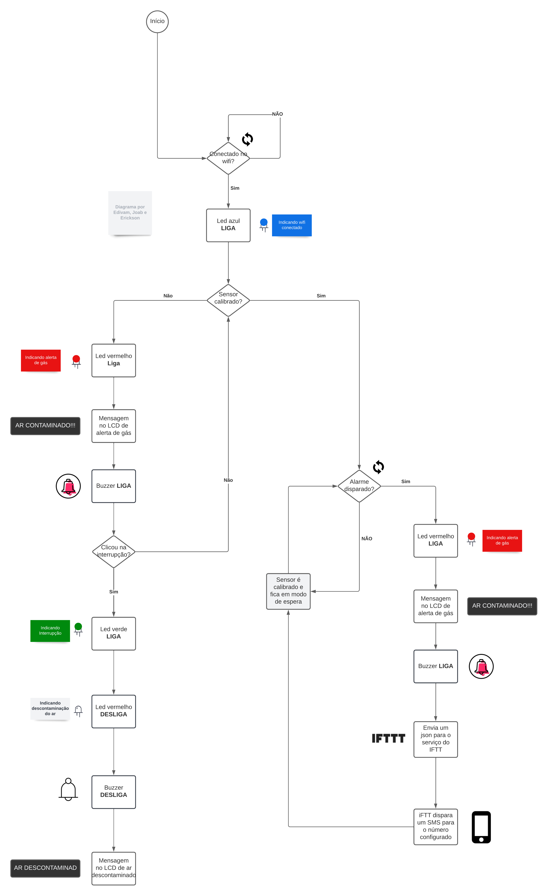
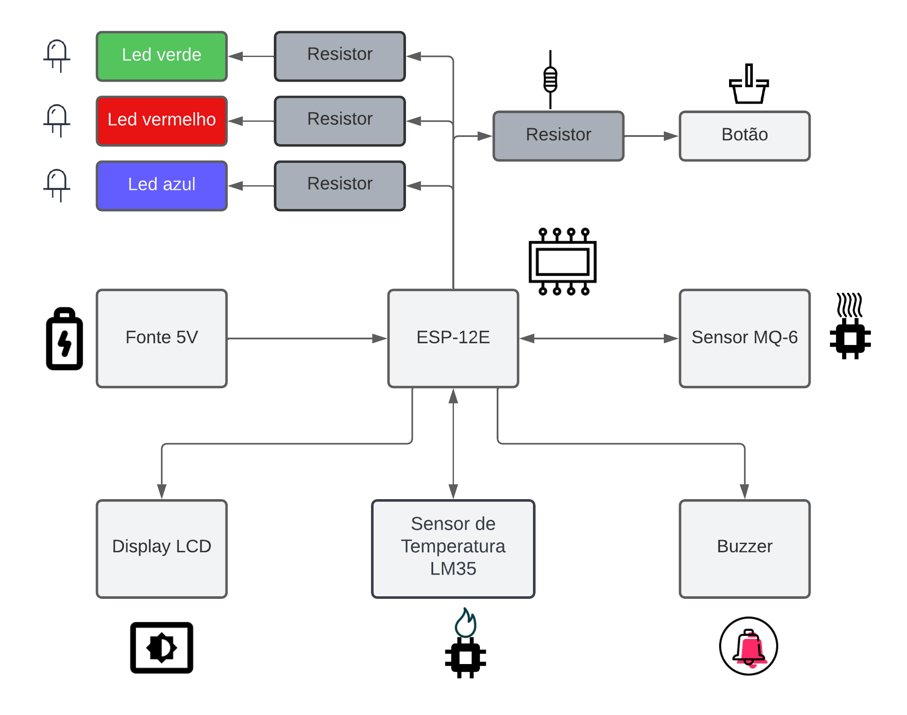

# Sistemas Embarcados - 2021.2

## 1. Instituição

-   Instituto Federal da Paraíba - IFPB
-   Campus Campina Grande

## 2. Docente responsável

-   [Professor Dr. Alexandre Sales Vasconcelos](https://github.com/alexandresvifpb)

## 3. Grupo

-   [Edivam Enéas de Almeida Júnior](https://github.com/venzel)
-   [Erickson Tulio Rodrigues Azevêdo](https://github.com/Erickson-Eng)
-   [Joab da Silva Maia](https://github.com/JoabMaia)

## 4. Descrição do projeto

Nesse projeto foi realizado desenvolvimento de um sistema embarcado que é capaz de identificar vazamento de gases, além disso, também apresenta todas as informações desse vazamento a partir de um display led e faz envio de mensagens SMS para celulares cadastrados em uma aplicação integrada.

## 5. Objetivos

### 5.1. Geral

-   O objetivo geral deste trabalho é o desenvolvimento de uma hardware de
    segurança doméstica para fornecer um sinal de alarme ao usuário caso aconteça
    vazamento de gás, além de informações na tela de temperatura.

### 5.2. Especificos

-   Criar um prototipo que seja capaz de realizar detecção de gás, apresentação de resultados via display e também conseguir realizar envio de mensagens SMS para o dispositivo cadastrado.

## 6. Resumo das arquiteturas

A seguir é no tópico 1 _Hardware_ é apresentado a placa e o case ambos construidos no aplicativo fusion 360 e em seguida no topico 2 _Firmaware e/ou Software/App_ é apresentado as especificações como circuito eletrico e PCB

### 6.1. Desenhos

-   3D

-   PCB

-   Circuito elétrico

## 7. Códigos

👉 [Teste do display lcd com I2C](./codes/teste_lcd_I2C/teste_lcd_I2C.ino) 
👉 [Teste do sensor de temperatura](./codes/teste_sensor_temperatura/teste_sensor_temperatura.ino) 
👉 [Teste do sensor de gás](./codes/teste_sensor-gas/teste_sensor-gas.ino) 
👉 [Teste da conexão com o wifi](./codes/teste_wifi/teste_wifi.ino) 
👉 [Código final do projeto](./codes/codigo_final_projeto/codigo_final_projeto.ino)

## 8. Vídeo do protótipo

## 9. Diagrama de processo

## 10. Diagrama de bloco

## 11. Resumo dos Resultados

Nesse projeto foi possivel construir um prototipo capaz de realizar a detecção de gases no qual, além disso, dispara alertas tanto para sua propria interface que é um componente LCD de 16 colunas e duas linhas, um alto-falante para emitir sinais sonoros e por fim interfaces externas com o uso de mensagem via SMS.

Foi possivel atingir os seguintes objetivos adicionais:

-   Instalação de libs dos módulos.
-   Realizar a implementação de thread.
-   Implementar sistema de interrupções.

## 12. Link dos arquivos

👉 [Esquema elétrico (EAGLE)](./3d/projeto_dispositivo_alarme_gas/esquema_eletrico/esquema_eletrico_eagle.sch) 
👉 [Esquema elétrico (FUSION)](./3d/projeto_dispositivo_alarme_gas/esquema_eletrico/esquema_eletrico_fusion.fsch) 
👉 [Imagens com furos da PCB (PARTE INFERIOR)](./3d/projeto_dispositivo_alarme_gas/imagem_bottom_side_da_pcb_manufacturing/imagem_bottom_side_da_pcb_manufacturing.png) 
👉 [Imagens com furos da PCB (PARTE SUPERIOR)](./3d/projeto_dispositivo_alarme_gas/imagem_top_side_da_pcb_manufacturing/imagem_top_side_da_pcb_manufacturing.png) 
👉 [Medidas dos furos da PCB (1)](./3d/projeto_dispositivo_alarme_gas/imagem_drils_da_pcb/imagem_drils_da_pcb.png) 
👉 [Medidas dos furos da PCB (2)](./3d/projeto_dispositivo_alarme_gas/imagem_drils_da_pcb/metricas_drills.csv) 
👉 [Layout da PCB (EAGLE)](./3d/projeto_dispositivo_alarme_gas/layout_da_pcb/layout_da_pcb_eagle.brd) 
👉 [Layout da PCB (FUSION)](./3d/projeto_dispositivo_alarme_gas/layout_da_pcb/layout_da_pcb_fusion.fbrd) 
👉 [Desenho 3D - Apenas PCB (FUSION)](./3d/projeto_dispositivo_alarme_gas/modelo_3d_da_pcb/modelo_3d_da_pcb.f3d) 
👉 [Desenho 3D - PCB + CASE (FUSION)](./3d/projeto_dispositivo_alarme_gas/modelo_3d_da_pcb/modelo_3d_da_pcb_e_case.f3z)
